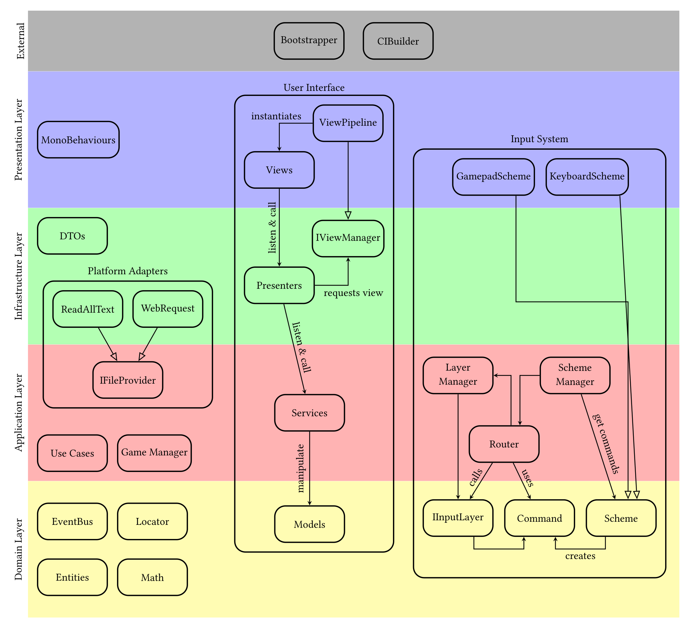
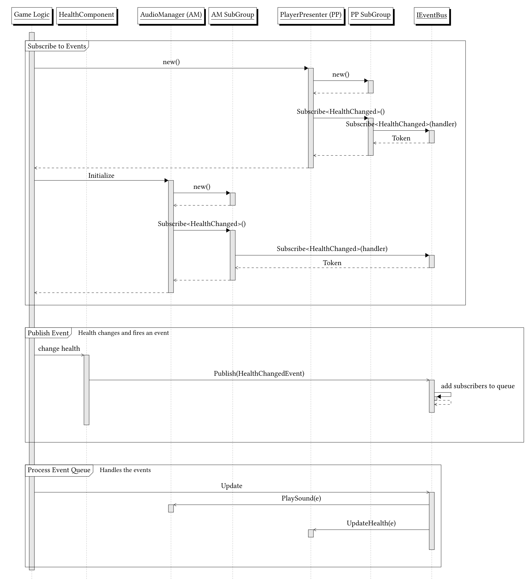
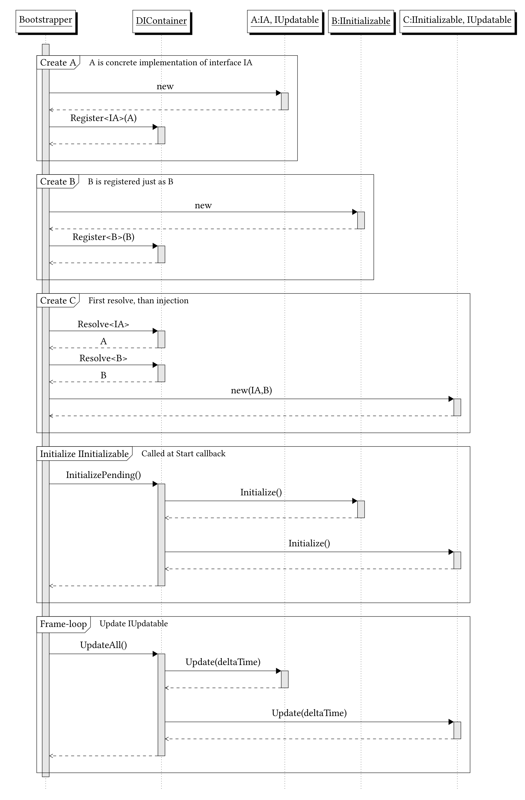

# A Unity Template for Clean Architecture
This is the repo to my master's thesis "Modular Game Architecture in Unity: A Case Study of Clean Architecture and Platform Optimization in Unbreachable".

## Abstract of my thesis
Publishing games across multiple platforms is becoming more attractive. However, it introduces significant architectural complexity due to requirements and different APIs. This thesis addresses the challenge of designing a modular, maintainable software architecture for multi-platform Unity games. Using the Design Science Research methodology, an architectural artifact is designed, implemented, and evaluated using a real-world use case, Unbreachable, an ongoing game project by Buckfish.

The designed architecture uses established design patterns combined with principles of Clean Architecture. This includes event-driven communication, dependency injection, and the Model-View-Presenter pattern. The use case was evaluated using code metrics, Windows and Steam Deck runtime benchmarks, and tests in the Unity Editor.

The results indicate that the software architecture improves maintainability and scalability, while still providing a desired performance. These findings demonstrate that architectural principles can be effectively applied to game development in Unity projects. The research contributes a validated software architecture, a Unity template, and empirical insights in developing scalable and maintainable games.

# Layers
Layering code into clear concerns helps improve code quality and maintainability. This separation reduces coupling and ensures that gameplay rules are independent from Unity-specific implementations. Unit testing can be done effectively outside of the Unity runtime. The layered architecture creates a more modular, flexible, and long-term sustainable codebase.

Four layers are introduced, which are most closely aligned with the proposed Clean Architecture layers. The most significant adaptations are the renaming and the change in the presentation layer's purpose. Each layer is explained in detail below.

The external layer has a special role. It has access to every layer and each platform realization. The most recognizable class here is the [bootstrapper](README.md#bootstrapper). Since it implements platform-specific behaviour, it cannot be packaged into the presentation layer, as that layer is split across platforms.

## Domain Layer
The domain layer is equal to the entity layer in the Clean Architecture. It includes the most robust rules, objects, and behavior. This layer is entirely self-contained and has no dependencies on any layers above it. A change in this layer often requires a complete recompilation of all other scripts.

This layer has no references to other assemblies, and no engine classes or functions are available. Thus, commonly used structs and classes such as rects, vectors, and matrices are implemented here, since the Unity ones are not available. Further, there are the [ServiceLocator](Assets/Scripts/01-Domain/Basics/ServiceLocator.cs) and the [event bus](Assets/Scripts/01-Domain/Event%20System).

## Application Layer
The application layer is the second layer and is similar to the second layer in Clean Architecture. This layer only depends on the domain layer. It contains all use cases, executes the game logic, and defines abstractions.

Since the use cases are game-dependent, there are no classes that are always contained in the application layer in any game. Games with an in-game shop could implement a shop service to handle item purchases in this layer. Also, an inventory service that adds or removes items could be implemented here. The inventory itself would be implemented in the domain layer. Any quest service could also be implemented here to update quest progress based on events.

One further purpose of this layer is to define the interfaces implemented by layers above it. Through dependency injection, the concrete implementation is injected at runtime. Those interfaces should often define functions with an asynchronous callback. Because the concrete implementation could be asynchronous, this must be considered in those interfaces and in how they are used in this layer. For example, reading a file can be handled synchronously; however, retrieving a file from the cloud should be done asynchronously and could fail. The service's interface must handle the most complex case. Otherwise, the concrete implementation influences a service's behaviour, which violates the Liskov Substitution Principle.

Additionally, the implemented services fire specific events that the layers above can subscribe to. A heavy-event-driven service could be the audio system, because it needs to adapt the music to the current state of the game and respond to many different events to trigger sound effects accordingly. For instance, a change in the player's money balance could trigger a buying or selling sound.

## Infrastructure Layer
The infrastructure layer serves as the translation layer and is similar to the third layer of the Clean Architecture. This is the first layer that has access to engine-specific implementations. 

In the third layer, most of the interfaces, defined by the application layer, are implemented. The concrete implementations may vary between platforms. Thus, multiple implementations could be found for a single interface. More can be found in the [platform adapters](README.md#platform-adapters) section.

Data transfer objects (DTOs) are often-used classes in the infrastructure layer. Those are used to receive data and translate it into the corresponding domain entities. This translation keeps the domain independent of the providing services. For instance, changing a name in a JSON file only affects the DTO, not the entity in the domain layer.

Presenters are another often-found class in the layer. Those are part of the [MVP pattern](README.md#user-interface). These can also be seen as a translator between the core application and a concrete user interface.

## Presentation Layer
The outermost layer is the presentation layer. This layer has been altered and differs from the fourth layer defined by Clean Architecture. More code is found in this layer than in Clean Architecture.

All necessary MonoBehaviours are implemented in this layer. Those include the views that are attached to a UI prefab. Concrete [input layers](README.md#input) and input schemes are also implemented in this layer. Those implementations often change in the progress of development due to new user expectations and experience. Thus, the presentation layer is typically the layer that undergoes the most frequent changes.

# Core Systems
## Event Bus
The event bus serves as an essential communication channel between services. As part of the domain layer, its primary purpose is to improve the decoupling. One service can listen in to what has occurred and react to them without the knowledge of other services. Also, it enhances the Open-Closed Principle . Additional services can be implemented by listening to the event bus and reacting to incoming events, without modifying the services that send the events. The concrete design of the event bus is available [here](Assets/Scripts/01-Domain/Event%20System/DecoupledEventBus.cs).

## Bootstrapper
The bootstrapper solves multiple problems in one go: tight component coupling, limited flexibility, layer entanglement, and code tied to a single platform. The bootstrapper centralizes lifecycle events, creates the services, and injects them using the dependency injection pattern. See the [HelloWorld-Example bootstrapper](Assets/Scripts/Bootstrapper/HelloWorldBootstrapper.cs).

The dependency inversion is necessary to separate layers and improve decoupling. A service does not directly reference an object. It references an interface, but the concrete implementation is unknown. The bootstrapper knows the concrete implementation and injects it into the constructor. The implementation can be easily swapped, improving flexibility and decoupling the concrete implementation from its usage. Another benefit is the platform abstraction. Depending on the platform the game is played on, the corresponding platform-specific service can be injected (see \autoref{Design/PlatformAdapters} for more details).

It is a MonoBehaviour component and must be attached to a game object in the first scene played. By modifying Unity's execution order, it is guaranteed that the bootstrapper's Awake method is executed first. In this method, most of the services are created, and most of the injection happens.

The bootstrapper creates service after service. A newly created service is saved in the  [DIContainer](Assets/Scripts/01-Domain/Bootstrapper/DIContainer.cs). If a service is a concrete implementation of an interface or abstraction, the container maps the interface to the concrete implementation on registration. After that, the concrete implementation can be resolved using the interface as the key. Thus, a concrete implementation can be exchanged by simply changing the registration. The bootstrapper continues instantiating the services. When a service needs an injection in its constructor, the container resolves it. The DIContainer also manages which services can be initialized and updated.

A manual dependency injection approach was chosen because the number of services in the Unbreachable use case is relatively small. Nevertheless, the injection process must be handled carefully. Each service must be instantiated and registered before it can be resolved, making the registration order crucial. Circular dependencies can be mitigated through field injection where necessary. The \codeRef{Awake} method, however, can quickly become complex as the number of services increases. This method represents one of the most intricate parts of the entire solution due to its dependency order, initialization logic, and overall importance. On the positive side, this approach results in services that are leaner, more modular, and better decoupled from one another.

Inside the constructor, a service has only limited functionality. Since not every service has been built yet, sending events through the event bus could cause problems. Thus, a service can implement the [IInitializable interface](Assets/Scripts/01-Domain/Bootstrapper/IInitializable.cs). In the bootstrapper's start method, this initialization function is called for each service that implements this interface. At this stage, all services have been created. Since only MonoBehaviours receive the Update method, services can also receive it by implementing the [IUpdatable interface](Assets/Scripts/01-Domain/Bootstrapper/IUpdatable.cs).

An advantage comes in testing services. Testing smaller parts of the game can be done by writing a custom bootstrapper with only the necessary services. Those services can additionally be exchanged quickly, which is beneficial for testing. 

## Service Locator
The service locator pattern provides a global access point to services, allowing components to obtain the services they require without depending on their concrete implementations and without injection. An example is shown [here](Assets/Scripts/01-Domain/Basics/ServiceLocator.cs)

The locator maintains a registry of available services and returns the instance at runtime. This approach promotes flexibility, as implementations can be replaced or configured at runtime without altering client code. However, because it hides dependencies behind a global access point, it can reduce transparency and complicate testing if overused. Thus, it is used only for services that must be used in many classes. Those include the event bus, a logging system, a random number service, and an asynchronous service.

The main benefit of using a service locator is that it reduces the number of required injections. Services such as an event bus or a custom logger are often needed across many parts of the application, and injecting them can create clutter. A service locator provides easy, centralized access to these services, thereby reducing the bootstrapper’s responsibilities.

## Async Operations using Coroutines
Asynchronous operations do not work reliably on WebGL because multi-threading support is limited. And there is a need to wait for specific tasks. For instance, retrieving a file can take up to several seconds. Blocking the main thread is not an option.

However, Unity has a built-in solution for async operations named coroutines. Those are handled on the main thread, but can be suspended. Using coroutines, a web request can be made, and the execution of the function will be suspended until the web request completes.

The [ServiceLocator](Assets/Scripts/01-Domain/Basics/ServiceLocator.cs) holds a concrete implementation of a [ICoroutineRunner](Assets/Scripts/01-Domain/Basics/ICoroutineRunner.cs). The concrete implementation is a MonoBehaviour attached to a game object in the current scene, since only MonoBehaviours can start a coroutine. A service implements an IEnumerator function (for example, see the [WebRequestFileProvider](Assets/Scripts/03-Infrastructure/Web/WebRequestFileProvider.cs)). This function is passed to the ICoroutineRunner and then executed. By using "yield return ...", the current execution is suspended. A simple frame skip is done by "yield return null".

## Platform adapters
Some services and providers need to be different depending on the context. The context could be a testing environment with a smaller set of services, or it could differ regarding the target platform.

The example in this section concerns a file provider implementation across various platforms. There is no direct file access possible in WebGL. The often-used method "File.ReadAllText" is not usable. Instead, a web request has to be made.

The solution defines an interface that the bootstrapper injects at runtime. This interface is shared with the services and is typically declared in the application layer, while its concrete implementations usually reside in the infrastructure layer. In the file provider example, centralizing access to files prevents each implementation from having to repeat the same conditional checks when reading a file.

The bootstrapper's purpose is to inject concrete implementations. Using Unity's preprocessor directives, platform-dependent service registration can be performed. The concrete implementations in the infrastructure layer are assigned to their respective assembly. For the file-providing case, the [WebRequestFileProvider](Assets/Scripts/03-Infrastructure/Web/WebRequestFileProvider.cs) would be in the "Infra.WebGL" assembly, so it is included only in the WebGL build. The more general [ReadAllTextFileProvider](Assets/Scripts/03-Infrastructure/Standalone/ReadAllTextFileProvider.cs) is inside the "Infra.Standalone" assembly. Using the "\#if UNITY_WEBGL" preprocessor directive, platform-dependent code can be executed. In this case, the following lines are executed only in the WEBGL build until the "\#else".

Once again, the interface definition is worth mentioning. The interface definition must be carried out carefully. The Liskov Substitution Principle plays a special role at this point. This means that the service should work regardless of the concrete implementation of the file provider, for example. The service initially plans to use the synchronous "File.ReadAllText" method because it is fast on a PC, and to ignore the file that does not exist, since it is always there. However, swapping to WebGL and using a web request can break those assumptions. The code will fail because of ignoring LSP. Thus, the interface should always be prepared for the "worst-case".

# User Interface
A robust user interface design is necessary for the long term. Since the UI often changes, there should be clear abstractions to support a fast-paced environment. Using the [MVP design pattern](https://unity.com/de/resources/level-up-your-code-with-game-programming-patterns), the tasks are split accordingly. An overview of the data flow is shown in the [overview figure](README.md#abstract-of-my-thesis).

## Model
The model can be a data class or a service, and it belongs to the domain or application layer. The model should provide different events for a presenter to hook into. Since those events are most often one-to-one communications, they are primarily implemented locally. If they go to the event bus, it would overload it. The model is entirely independent of the user interface. The behavior of a service or model should remain consistent regardless of whether the application is a full-screen 3D environment or a console-based game.

## Presenter
The presenter is in the infrastructure layer and has the purpose of translation. It communicates with the model in two ways. The first receiving one is done through the events. By listening to those, the presenter knows what is happening. The second one is the sending one. Depending on the actions and the view, the presenter calls the model's direct functions to manipulate the model's state.

The second communication happening in the MVP pattern is between the presenter and the outer layer. The presenter is called directly by the view and optionally by an [input layer](README.md#input). From the other direction, the presenter, similar to the model, has events that the view script can listen to.

A presenter can only have one view at a time. The presenter requests a view through the \codeRef{IViewManager}. This is often used to open a UI interface. For instance, when the settings button is pressed, the presenter receives it and opens the settings menu. It should first be instantiated, so it requests a view.

## View
The view is in the presentation layer and is often changed. It inherits from MonoBehaviour and sits as a component on the root of the UI prefab. Its purpose is to know all the concrete Unity UI elements and to communicate the current state. By receiving events from the presenter, the UI elements are updated. By listening to UI elements (e.g., buttons, input fields, and hovering), actions are passed down to the presenter.

## View Pipeline

The [view pipeline](Assets/Scripts/04-Presentation/Shared/User%20Interface/ViewPipeline.cs) is the concrete implementation of the [IViewManager](Assets/Scripts/03-Infrastructure/Shared/User%20Interface/IViewManager.cs). Its purpose is to instantiate the view corresponding to a presenter. There are multiple requirements for the view pipeline. It should be able to change how it retrieves prefabs to use addressables or other systems. It is also essential to inject services into the view when needed.

When a presenter requests a view, it first checks whether it is currently instantiated. If so, the callback fires successfully. If not instantiated, the prefab will be provided by a concrete implementation of [IPrefabProvider](Assets/Scripts/03-Infrastructure/Shared/User%20Interface/IPrefabProvider.cs). Its task is to get the prefab. It does not instantiate it. The view pipeline does not care whether the prefab is received via an [addressable system](Assets/Scripts/04-Presentation/Shared/User%20Interface/AddressablePrefabProvider.cs) or via direct referencing, e.g., via a scriptable object. However, since the addressable system requires asynchronous loading, the prefab load is async. When the presenter calls the view pipeline to delete the view before it even gets instantiated, the process needs to be cancelled.

After the prefab is retrieved, it is instantiated through a [view factory](Assets/Scripts/04-Presentation/Shared/User%20Interface/ViewFactory.cs). Each view factory has to be created by the bootstrapper and injected into the view pipeline. It caches all view factories so they can be called when a view is requested. Using this pattern, the bootstrapper is still responsible for injecting services into the view, even though it does not directly create the view. The injection resolves when the view is made, not when the view factory is created.

When the view instantiation is successful, the initial callback will be called successfully. There, the view already listens to the presenter's event because of the view factory. Thus, invoking the presenter's events to update the view in the callback is convenient. For the presenter, there is no difference regarding the callback, whether the view is already instantiated or newly instantiated.

## Hello World Example
Since the concrete implementation of a presenter or the view is highly dependent on the context, a concrete example is included. There is a [service](Assets/Scripts/02-Application/HelloWorldService.cs), that counts a number. This counter holds the truth. A game event is published to the event bus if the counter changes. The [presenter](Assets/Scripts/03-Infrastructure/Shared/HelloWorldPresenter.cs) listens for this event and notifies the [view](Assets/Scripts/04-Presentation/Shared/HelloWorldView.cs). The view displays the new value. If the button is pressed, the view calls "OnIncreaseCounterRequested" from the presenter, which then calls the corresponding method from the service to increase the counter. Besides the view, there is also an [input layer](Assets/Scripts/04-Presentation/Shared/Input/HelloWorldInputLayer.cs) that reacts to key presses and calls the presenter if so.

# Input

The input system has the purpose of mapping whatever the player inputs to an expected action. Similar to the UI system, these mappings can change frequently due to new requirements. One requirement involves the variety of input devices. For instance, an Xbox player would expect the south button to submit something. On the other hand, a PlayStation player is used to use the south button for cancellation. The input system must account for users' expectations and hardware requirements. The proposed design uses a layering approach to handle input. The \autoref{fig:inputsequence} shows a sequence diagram of how the different components work and communicate with each other.

There are some essential classes in the upcoming sections. [Input commands](Assets/Scripts/01-Domain/Input/InputCommand.cs) are on the logic side and abstract raw inputs to user-expected actions. An [input layer](Assets/Scripts/01-Domain/Input/IInputLayer.cs) is an object that handles commands. The [input router](Assets/Scripts/02-Application/Input/InputRouter.cs) traverses a command through the layers until it is consumed or all layers have been traversed. The [input layer manager](Assets/Scripts/02-Application/Input/InputLayerManager.cs) retrieves active layers and keeps a prioritized list of those. The [scheme manager](Assets/Scripts/02-Application/Input/InputSchemeManager.cs) handles different devices and sends commands to the router.

## Generate Commands
In the first step, raw input has to be captured and translated into input commands. An input command is a user-expected action, such as opening a shop, canceling, or moving the camera. This command design pattern helps to abstract the concrete user input and interpret it. The layers below should not care whether the player uses a mouse, keyboard, or gamepad. They care about commands.

Since the raw input depends on the input device, schemes are introduced to address this. Each scheme is responsible for translating a specific device's inputs into commands and sending them to the input router. By using Unity's Input System, the device state of the inputs can be read directly. The [scheme manager](Assets/Scripts/02-Application/Input/InputSchemeManager.cs) keeps track of all possible [schemes](Assets/Scripts/01-Domain/Input/Schemes/IInputScheme.cs). Only one scheme can be active at a time. By checking if a disabled scheme received input, the scheme can be swapped. However, some inputs still need finishing. For instance, dragging must be stopped when switching schemes. Otherwise, this could result in unexpected behaviour in the input layers.

## Deliver Commands
The [input router](Assets/Scripts/02-Application/Input/InputRouter.cs) has the specific role of routing the commands through the layers. It first retrieves the sorted layers from the [input layer manager](Assets/Scripts/02-Application/Input/InputLayerManager.cs) and then routes each command from the top-most layer to the bottom-most layer. Whenever the command, which is currently routed, is consumed, the routing will be cancelled. Thus, a layer can block a lower layer from receiving a command. It is noticeable that Unity's input system does not support consumption. Therefore, Unity's solution does not work here.

The mentioned input layer manager maintains a prioritized, top-down list of all input-receiving layers. Each input layer has one of the following types: SystemOverlay, Popups, HUD, or Gameplay. Those types are used for prioritization. Layers of type SystemOverlay always receive the highest priority, as they are used for special situations. Popups are prioritized next, ensuring they consume input before either HUD or Gameplay. HUD is prioritized over Gameplay. By categorizing layers by type, the system provides a consistent, predictable order of input handling.

The scheme manager calls the input router. The scheme manager retrieves a command queue from the active scheme and sends each command to the router, which then processes it as described above.

## Interpret Commands
A command needs to be interpreted into a meaningful consequence in the game logic. The input layers do that interpretation. Each object that wants to receive input must implement the [IInputLayer](Assets/Scripts/01-Domain/Input/IInputLayer.cs) interface. The second requirement is to push itself to the input layer manager. Then it is part of the routing and can receive commands via the "HandleInput" function. 

As a parameter, the generic command is passed. By casting, the command can be further interpreted. For instance, the camera handler will try to cast the command to the "MovementCommand". If it fails, the command is ignored. If the casting is successful, interesting parameters, such as the Vector2 delta, can be accessed in the concrete commands. Then, the camera can update itself to that delta. Before returning, the command is consumed to prevent further processing.

One benefit of that abstraction is that the same command can be interpreted in different layers but result in the same user-expected action. For instance, pressing the escape key is translated into a "LeaveCommand" because the user expects something to be closed or left. When sending the command to the layers, it could be consumed by a pop-up window, which then closes. Pressing again could close another open window. The same command is used in multiple layers.

One notable common input layer is regarding the UI. Each MVP flow can be extended by an input receiver that implements the input layer. This references the presenter and, like the view, will react to input and call presenter functions based on those inputs. Commonly, those will push themselves to the layer manager when the presenter opens the view and pop themselves back out of the layer manager when the view is closed. Those can be done by listening to the presenter's events. The presenter does not know about the input layer that acts on it.

## Unity's Event System
Unity's event system handles input for UI elements. It is responsible for feedback when hovering over, pressing, and navigating the UI. This behaviour can conflict with the proposed design. For instance, clicking on a button should block commands that do similar things. 

By introducing a [custom layer](Assets/Scripts/04-Presentation/Shared/Input/UnityUILayer.cs) as the SystemOverlay, this problem can be handled. This layer serves solely to block specific commands based on the event system. In the proposed example, the zooming command is blocked because scroll rects are used. A future optimization could implement a custom input module to better integrate into the proposed design.

# How to Build
Building the game in Unity itself for a single platform is most often reliable and practical. Building for multiple platforms with post-build scripts can be complicated. Also, one requirement is the building for all target platforms at once. This is why a custom build pipeline is introduced.

As a requirement for the build pipeline, there should exist a build profile for each platform. Those profiles are used to override scripting defines and player settings, and to target the correct platform. For instance, there is no preprocessor directive for the Steam Deck, unlike on other platforms. Thus, the Steam Deck's build profile automatically defines a preprocessor directive called "Steam_Deck".

The entry point of the custom build pipeline is [CIBuilder.BuildFromCommandLine](Assets/Scripts/Editor/BuildSystem/CIBuilder.cs). It expects the platform as an argument. The expected platform identifiers are "Windows", "Mac", "Linux", "WebGL", and "SteamDeck". By running Unity from the command line, the function can be called. The structure of the command is "Unity.exe -batchmode -quit -projectPath {pathToProject} -executeMethod UnityBuilder.CIBuilder.BuildFromCommandLine -platform {platformID}". Only one instance can run at a time, so building for multiple platforms requires waiting for each build to finish before starting the next.

The script will first load the profile associated with the target platform. It will then build the addressables platform-dependent. Addressable groups are excluded when the defined rules fail (see [here](Assets/Scripts/Editor/BuildSystem/AssetBundleBuilder)). After that, the script starts the actual build. Folders that should not be shipped with the application are automatically deleted after building. Also, the streaming assets folder is cleaned.

The streaming assets folder can have platform-dependent content (see code [here](Assets/Scripts/Editor/BuildSystem/SteamingAssetsCleaner.cs)). For instance, shipping an executable should only be available on Windows. By default, everything in this folder is included in the build. A folder can be marked with platform-specific folders by adding a "platforms.json" file (see [here](Assets/StreamingAssets/Windows-only/platforms.json) for a Windows-only folder). The build pipeline will delete the folder if the platform is not included. This can drastically reduce the final build size.
